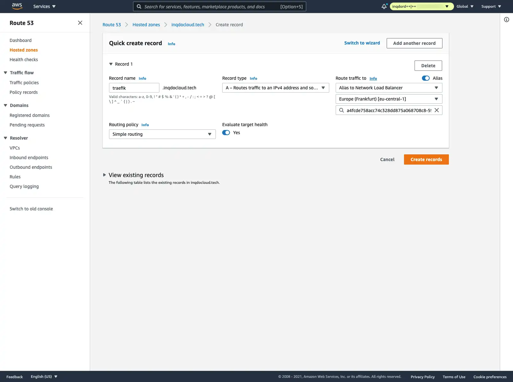
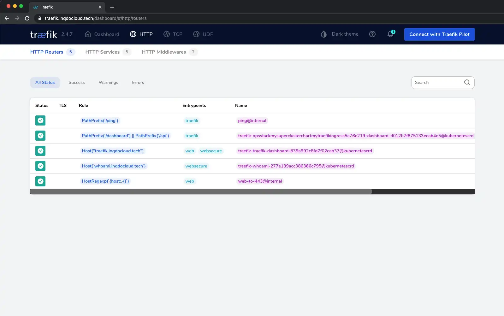

## Define a few variables (only auth string used for Traefik dashboard below)
```javascript
export const hostedZone: string = "inqdocloud.tech";

// Use htpasswd -nb user password | openssl base64 to generate this
// Only used for Traefik dashboard
export const traefikBasicAuthString: string = "cmFmOiRhcHIxJDR4eEczM20wJG52SXhpSDJESTZmZHpFSnJpN2c5YjAKCg==";
```

## Define Route53 resources (not used below)
```javascript
// Lookup hosted zone
const zone = route53.HostedZone.fromLookup(this, "MyCoolHostedZone", {
  domainName: hostedZone,
});

// Create a wildcard certificate for our hosted zone
const cert = new acm.Certificate(this, "MySecureWildcardCert", {
  domainName: `*.${hostedZone}`,
  validation: acm.CertificateValidation.fromDns(zone),
});
```

## Provisioning the EKS cluster
```commandline
eksctl create cluster
--name "MyCluster"
--vpc-nat-mode "Single"
--with-oidc # Do we need this?
--node-type string
--instance-types strings         # Comma-separated list of instance types (e.g., --instance-types=c3.large,c4.large,c5.large
--nodes int                      # total number of nodes (for a static ASG) (default 2)
--nodes-min int                  # minimum nodes in ASG (default 2)
--nodes-max int                  # maximum nodes in ASG (default 2)
--node-volume-size int           # node volume size in GB (default 80)
--node-volume-type string        # node volume type (valid options: gp2, gp3, io1, sc1, st1) (default "gp3")
```

## Adding the Traefik Ingress controller
Use traefik helm chart:
```yaml
chart: "traefik",
repository: "https://helm.traefik.io/traefik",
namespace: "traefik",
values: {
ingressRoute: {
  dashboard: {
    enabled: true,
  }
},
ports: {
  web: {
    redirectTo: "websecure",
  }
},
service: {
  annotations: {
    "service.beta.kubernetes.io/aws-load-balancer-type": "nlb",
    "service.beta.kubernetes.io/aws-load-balancer-ssl-cert": "<our-dynamically-updated-arn>",
    "service.beta.kubernetes.io/aws-load-balancer-ssl-ports": "443",
  },
  spec: {
    externalTrafficPolicy: "Cluster",
  }
}
}
```

```commandline
helm repo add traefik https://helm.traefik.io/traefik
helm repo update
```

## Add traefik dashboard
```yaml
apiVersion: "v1"
kind: "Secret"
metadata: 
  name: "traefik-dashboard-basicauth-secret"
  namespace: "traefik"
data:
  users: traefikBasicAuthString
---
apiVersion: "traefik.containo.us/v1alpha1"
kind: "Middleware"
metadata:
  name: "traefik-dashboard-basicauth"
  namespace: "traefik"
spec:
  basicAuth:
    secret: dashboardAuth.metadata.name
---
apiVersion: "traefik.containo.us/v1alpha1",
kind: "IngressRoute",
metadata: 
  name: "traefik-dashboard",
  namespace: "traefik"
spec:
  entrypoints: ["websecure"],
  routes:
    - kind: "Rule",
      match: `Host("traefik.<domain name>")`
      middlewares:           
      - name: dashboardMiddleware.metadata.name
        namespace: "traefik"          
      services:
      - kind: "TraefikService"
        name: "api@internal"
```

```commandline
aws eks update-kubeconfig \
--name MySuperCluster2CBDE9FD-3541efa24a824a7784c44dd384913425 \
--region us-east-2 \
--role-arn arn:aws:iam::1087695414932:role/OpsStack-MySuperClusterMastersRole925EEEFB-6JPADWOJ1APE

kubectl get svc -n traefik
```

## Add A record for domain name
Add an A record and pick the network load balancer from above:


Then navigate to `traefik.<domain name>.com`

## Deploy Sample app
Define service/deployment
```yaml
apiVersion: apps/v1
kind: Deployment
metadata:
  name: whoami
  namespace: traefik
  labels:
    app: whoami

spec:
  replicas: 2
  selector:
    matchLabels:
      app: whoami
  template:
    metadata:
      labels:
        app: whoami
    spec:
      containers:
        - name: whoami
          image: traefik/whoami:latest
          ports:
            - containerPort: 80
---
#apiVersion: v1
#kind: Pod
#metadata:
#  name: whoami
#  namespace: traefik
#  labels:
#    app: whoami
#spec:
#  containers:
#    - name: whoami
#      image: traefik/whoami:latest
#      ports:
#        - containerPort: 80
---
apiVersion: v1
kind: Service
metadata:
  name: whoami
  namespace: traefik
spec:
  ports:
    - port: 80
      protocol: TCP
      targetPort: 80
  selector:
    app: whoami
  type: ClusterIP
```

Then, define ingress route:
```yaml
apiVersion: traefik.containo.us/v1alpha1
kind: IngressRoute
metadata:
  name: whoami
  namespace: traefik
spec:
  entryPoints:
    - websecure
  routes:
    - match: Host(`whoami.<domain nam>.tech`)
      kind: Rule
      services:
        - name: whoami
          port: 80
```
You will be able to see the additional endpoint in the traefik dashboard:

